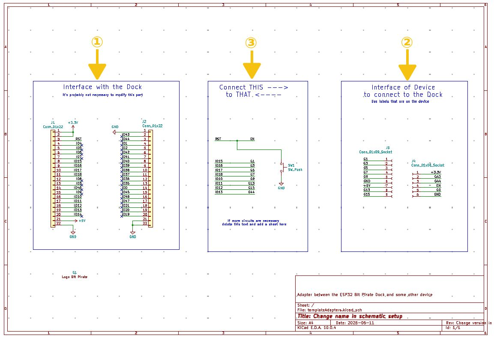

Template directory
==================

# Installation

- Copy the **templateAdapters** directory in your **KICAD_USER_TEMPLATE_DIR**
- It will then be displayed in the template list when you create a new project (The template is easy to identify with the Bit Pirate logo).

# How to use
## The schematic
The schematic is divided in 3 parts

1. this part is the interface with the dock. It shows all the IOs that the are exposed to the adapter. By default all the IOs but the 8 ones that are routed to the outside of the dock and the power supplies are tagged as not used. This part is not supposed to be modified.
2. this part is the interface of the device to be connected to the Dock. All the necessary connectors must be added and it is recommanded to use the same label for the IOs as the one used in the device documentation (as long as there is no conflict with the labels of the Dock).
3. this part describes the connexion between the device and the Dock. A least, this part must displays wich IO of the device connects to which IO of the Dock. If some hardware is to be added, it can be drawn in this part or an external sheet can be added in case it is too bulky.

The name of the board and the version number can be changed in Files/Schematic Setup/Text Variables. Their values will be paste to the PCB.  
After the text variables are modified you must: save the schematic, update the PCB, save the PCB, close the PCB, reopen the PCB, the name and version must now be up to date.

## The PCB
By default the PCB is the size of the ESP32-S3 devkit and J1-J2 connectors are locked in place so they will have the right spacing and position.
