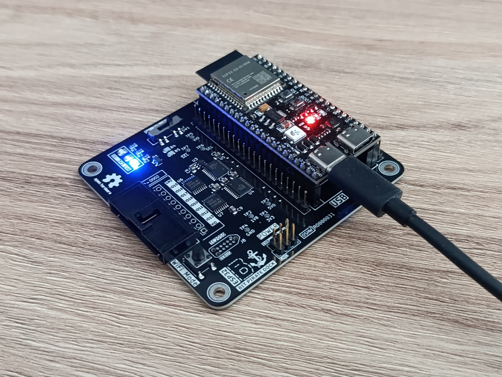
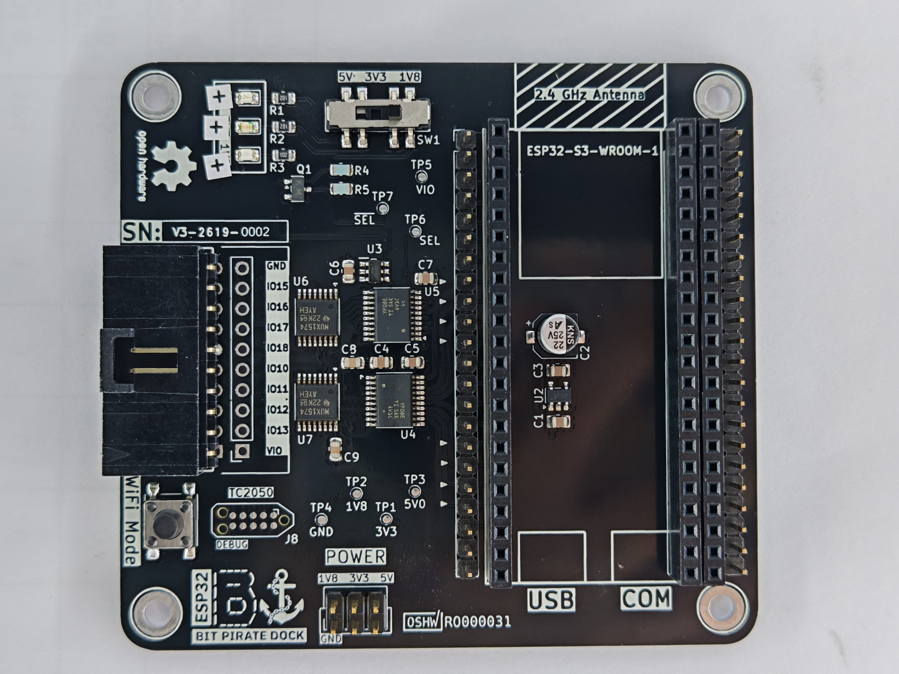
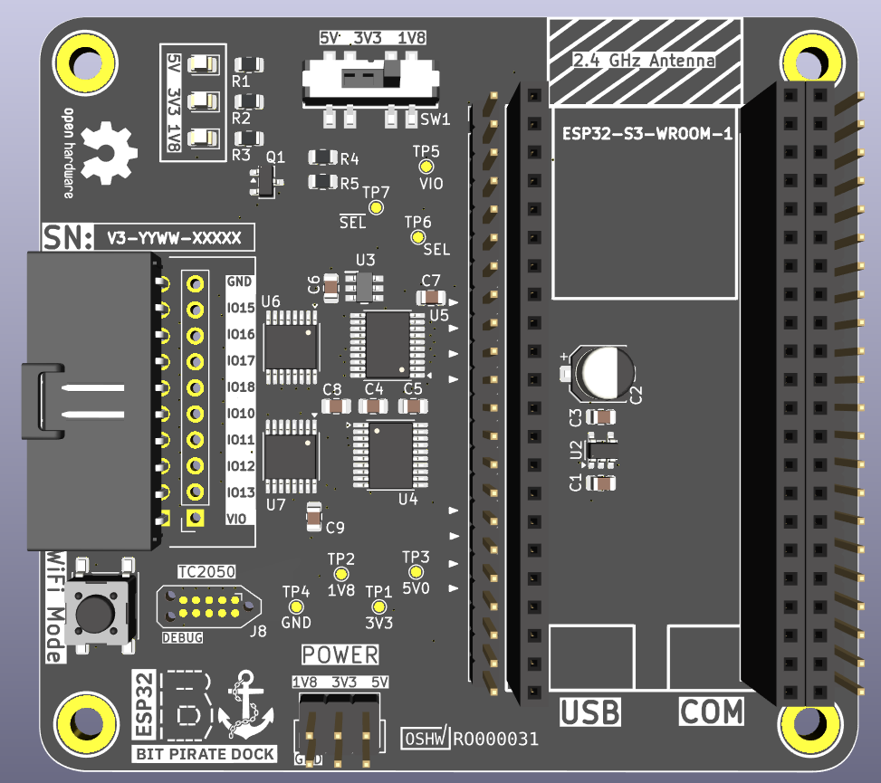
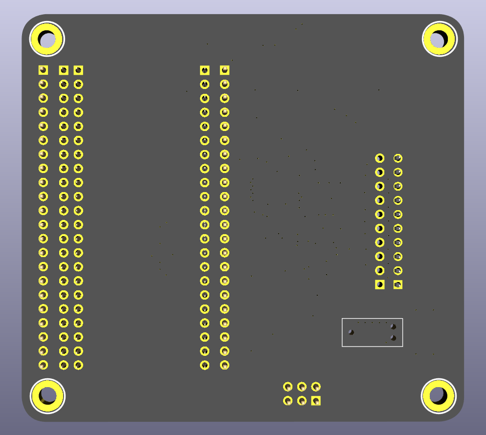
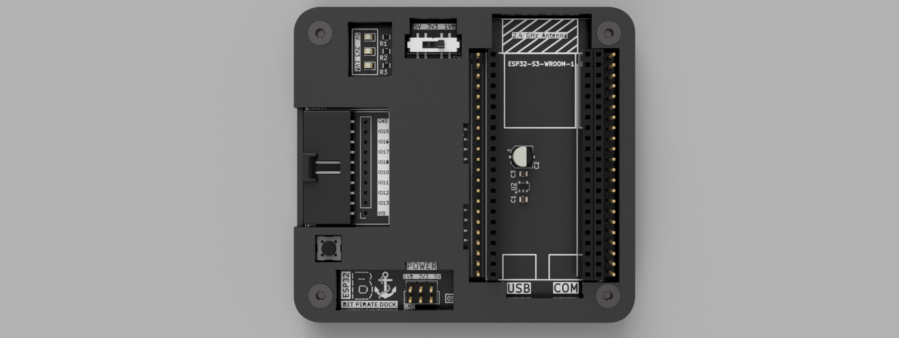

# ESP32-Bit-Pirate-Dock

**ESP32-Bit-Pirate-Dock** is an open-source carrier board for the Espressif ESP32-S3 DevKit, designed to complement the [ESP32-Bit-Pirate](https://github.com/geo-tp/ESP32-Bit-Pirate) firmware by [geo-tp](https://github.com/geo-tp).

It provides level and voltage translation between the 3.3V ESP32-S3 and external peripherals, with support for **1.8V**, **3.3V**, and **5V** operation. See the [Hardware status](#-hardware-status) section for the current revision, and grab the [fabrication files](#-manufacturing-and-assembly) to build your own.

## 🙏 Thanks to PCBWay

A big thank you to [**PCBWay**](https://www.pcbway.com/) for sponsoring and manufacturing the PCBs for this project. Their high-quality fabrication and assembly made bringing this dock to life possible.

## ✨ Features

- **Level & voltage translation** between the 3.3V ESP32-S3 and external peripherals.
- **Selectable I/O voltage:** 1.8V, 3.3V, and 5V operation.
- **Carrier board** for the original ESP32-S3-DevKitC-1 as well as third-party clones.
- **Designed as a companion** to the [ESP32-Bit-Pirate](https://github.com/geo-tp/ESP32-Bit-Pirate) multi-protocol firmware.
- **Fully open-source hardware** — schematic, PCB layout, gerbers, and BOM included.
- **3D-printable enclosure** — two-piece FDM case provided.

## 📦 Supported Devices

| Device | Notes |
|--------|-------|
| **ESP32-S3-DevKitC-1** | Genuine Espressif devkit — the reference target for this design. |
| **ESP32-S3 DevKit clones** | Third-party boards work as long as the header pin layout and board dimensions match the official devkit. There is also support for clones which are 2.54mm wider, but you need to measure them to make sure everything will fit|

> [!NOTE]
> This project requires an **ESP32-S3 DevKit to be procured separately by the end user**.

## 🔧 Hardware status

Current hardware revision: **V3**

The markings on the PCB for the serial number `V0-YYWW-XXXXX` are as follows:

- version `0`
- year and week number when these PCBs were produced
- incrementing number of the current batch

An example PCB with these markings would be `V3-2613-00512`, where:

- version number is `3`
- the year is `2026`, and the week is `13`
- this is the `512th` PCB made in that respective week

## 🚀 Getting Started

1. 🛒 **Source an ESP32-S3 DevKit**
   - Buy a genuine board from Espressif or a compatible clone.

2. 🏭 **Fabricate the dock**
   - Send the gerbers in `dock/gerbers/` to your PCB manufacturer of choice.
   - Use `dock/BOM.csv` to source the components for assembly.

3. 🖨️ **Print the enclosure** *(optional)*
   - Print the two-piece case from `dock/3d_models/` on an FDM printer with a 0.4 mm nozzle.

4. 🔌 **Assemble & seat the devkit**
   - Insert the ESP32-S3 DevKit into the headers and select your target I/O voltage (1.8V / 3.3V / 5V).

5. ⚡ **Flash the firmware**
   - Install [ESP32-Bit-Pirate](https://github.com/geo-tp/ESP32-Bit-Pirate) and start probing.

## 📂 Repository contents

- `dock/kicad/` — KiCad design files
- `dock/gerbers/` — PCB fabrication outputs
- `dock/schematic.pdf` — exported schematic reference
- `dock/BOM.csv` — bill of materials
- `dock/3d_models/` — 3D models for the dock and a WIP case
- `c5_adapter/` — KiCad design files for the companion C5 adapter board
- `images/` — presentation images

## 🌐 Open-source scope

This repository open-sources the dock hardware design, including:

- schematic and PCB layout source files
- fabrication outputs
- bill of materials
- project documentation and images included in this repository

## 🧩 Required external parts

This project requires an **ESP32-S3 DevKit to be procured separately by the end user**.

The ESP32-S3 DevKit is a third-party board/module and is **not included** as part of this hardware design repository unless explicitly stated. Vendor silicon, datasheets, trademarks, and separately licensed third-party materials remain the property of their respective owners.

These boards can be acquired through the official Espressif manufacturer and its stores, or through other third-party websites. If not buying a genuine one, make sure the dimensions fit one of the header pins on the board.

## 🛠️ PCB Design

### Top View

  
  

## 🏭 Manufacturing and assembly

- To **fabricate the PCB**, use the files in `dock/gerbers/`.
- To **inspect or modify** the design, use the original KiCad source files in `dock/kicad/`.
- To **source components**, use `dock/BOM.csv`.

## 📐 Case Design

The current design uses two pieces, which can be printed using an FDM printer with a 0.4 mm nozzle.

## 🤝 Related Project

This dock is built to complement [**ESP32-Bit-Pirate**](https://github.com/geo-tp/ESP32-Bit-Pirate) by [geo-tp](https://github.com/geo-tp) — an open-source firmware that turns your device into a multi-protocol hacker's tool, inspired by the [Bus Pirate](https://buspirate.com/) project.

## 📜 License

Hardware design files in this repository are licensed under the **CERN-OHL-W-2.0** license. See [LICENSE](LICENSE) for the full license text.

Documentation and images in this repository are licensed under **CC BY 4.0** unless otherwise noted.

Any third-party trademarks, datasheets, and separately licensed materials remain the property of their respective owners.

## ⚠️ Warning

> ⚠️ **Voltage Warning**: External peripherals should only be connected at the **selected translation voltage** (**1.8V**, **3.3V**, or **5V**).
>
> *   Do **not** connect peripherals using other voltage levels — doing so may **damage your ESP32 or the dock**.
> *   Always confirm the selected I/O voltage before powering up connected hardware.
>